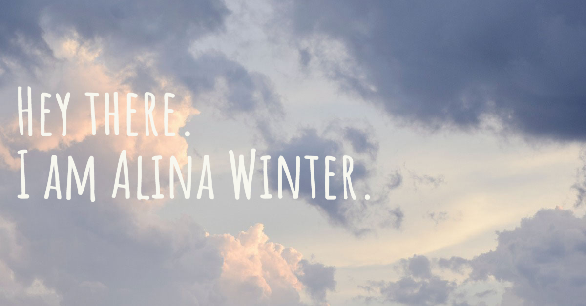

<!--
**alinawinter/alinawinter** is a ✨ _special_ ✨ repository because its `README.md` (this file) appears on your GitHub profile.

Here are some ideas to get you started:

- 🔭 I’m currently working on ...
- 🌱 I’m currently learning ...
- 👯 I’m looking to collaborate on ...
- 🤔 I’m looking for help with ...
- 💬 Ask me about ...
- 📫 How to reach me: ...
- 😄 Pronouns: ...
- ⚡ Fun fact: ...

an interesting text / description about yourself,
a link to a picture / gif,
a list or table.

 good commit message is an art form in itself. Try to stick to the following rules:

Be short and descriptive
Always use english
The first word should be a verb: "add", "fix", "remove", etc.
Use imperative and present tense: "add shop page" instead of "added shop page"
Do not end your commit message with a period
When in doubt, describe why you did something instead of how: "fix typo" instead of "replaced the letter a with an e in the second word"

-->

I am a political scientist turned developer. Currently, I am completing an intensive full-time [web development training](https://www.neuefische.de/en/bootcamp/web-development) at [neue fische](https://www.neuefische.de/)

#### Technical development skills:
- HTML
- CSS
- Javascript

#### Soft skills:
- problem solver
- empathic
- responsible
- self-dependent
- well-organised
- continuous development
- international experience

Feel free to connect with me on **[LinkedIn](https://www.linkedin.com/in/alina-winter-b404a6182/)**
